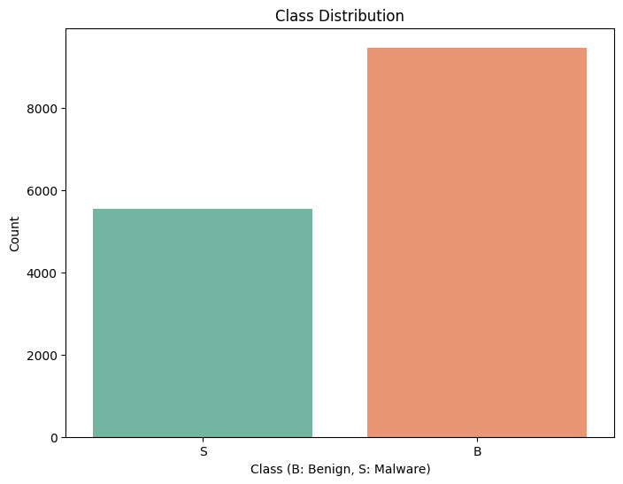
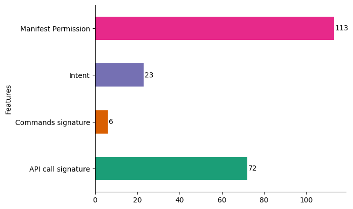
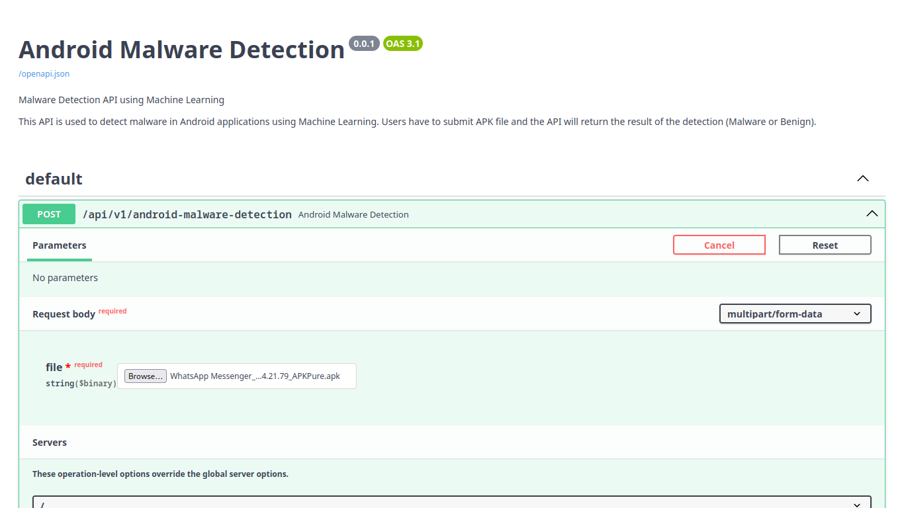

# Android Malware Detection Using Machine Learning

## Project Overview
This project aims to build an effective classification model to classify a mobile application as **Benign** or **Malware**. To do so, we'll evaluate multiple classification models using different metrics and select the best model with better performance for our dataset. Finally, we deployed our model as a REST API using FastAPI.

## Dataset

The dataset used in this project, hosted on [FigShare](https://figshare.com/articles/dataset/Android_malware_dataset_for_machine_learning_2/5854653), contains feature vectors of 215 distinct attributes gathered from 15,036 mobile applications-5,560 classified as malware from the [Drebin](https://drebin.mlsec.org/) project and 9,476 as benign. It is structured with 215 columns and 15,036 rows, designed for binary classification where the target variable differentiates between **Malware (S) and Benign (B) apps**. Each attribute is encoded in binary format: 0 indicates an attribute's absence, while 1 denotes its presence. The class distribution is the following:



The 215 features of the dataset are divided into four different categories: **API Call Signature, Manifest Permission, Intent, Commands signature**.



## Machine Learning Models
Several machine learning models were tested, including:

- Random Forest
- XGBoost
- LightGBM
- Extra Tree Classifier
- Logistic Regression
- Support Vector Machine
- AdaBoost
- Decision Tree
- Bagging
- Bayesian

## Model Comparison

The models were evaluated based on accuracy, precision, recall, F1-score, and ROC AUC. XGBoost model emerged as the best performer with the following metrics:

- **Accuracy**: 0.986698
- **Precision**: 0.98914
- **Recall**: 0.975022
- **F1 Score**: 0.982031
- **ROC AUC**: 0.998764

## Fine-tuning

Using GridSearchCV, the hyperparameters for the XGBoost were fine-tuned to maximize recall. The optimal parameters were:

- **colsample_bytree**: 0.8
- **learning_rate**: 0.2
- **max_depth**: 7
- **n_estimators**: 200
- **subsample**: 1.0

## Deployment

To deploy our model, we package everything within a Docker container and expose the model as an API. When a user wants to make a prediction, they submit an APK to the API. The first step in the process involves reverse-engineering the APK to extract all the features necessary for the prediction. These features are then used to determine the status of the application. The complete workflow is illustrated in Figure:


To have access to the application, you have to follow the following steps:

1. Have Docker installed on your computer
2. Run the following command: `docker run -p 8080:8000 tderick/android-malware-detection`
3. Go to [http://localhost:8080/docs](http://localhost:8080/docs) to test the application.

The following pictures show the analysis of the WhatsApp APK:




You can download the APK version of mobile apps at [https://apkpure.com](https://apkpure.com) to test.

## Build the docker image
```
docker build -t tderick/android-malware-detection:latest .
```

## Run the image
```
docker run -p 8080:8000 tderick/android-malware-detection:latest
```

## Push to docker hub
```
docker push tderick/android-malware-detection:latest
```
